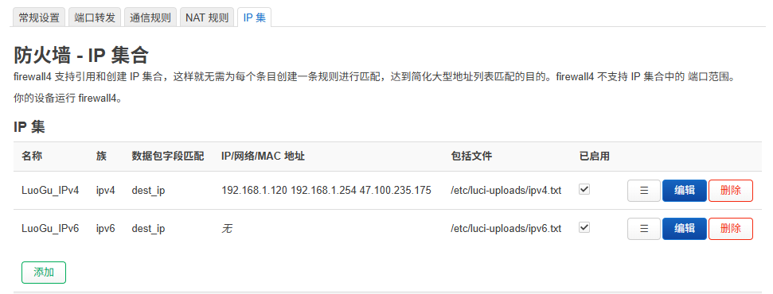
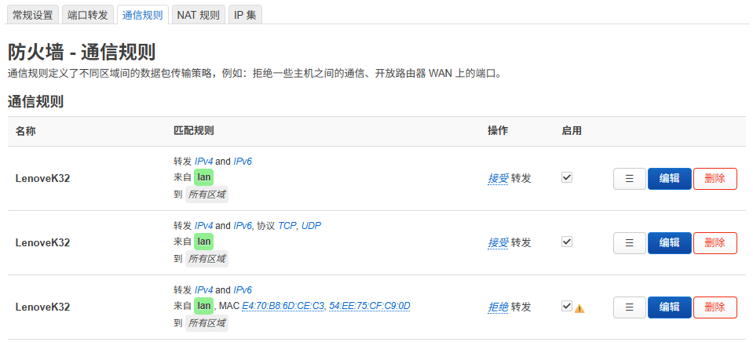

儿子喜欢玩游戏，经常偷偷摸摸玩，想了办法限制其电脑访问游戏网站。使用了白名单访问功能，只允许其电脑访问个别几个网站域名。

本程序分为二个部分：

**一、通过openwrt路由器来控制某电脑只能访问白名单**

1. 目录openwrt中的auto_sub_lookup.sh,用于在openwrt防火墙中生成下面两个文件：
   
    ```
    /etc/luci-uploads/
        ipv4.txt
        ipv6.txt
    ```
    
2. 通过修改auto_sub_lookup.sh中的DOMAINS变量中的域名来调整域名白名单：
   
    ```
    DOMAINS="luogu.com.cn
        kpcb.org.cn
        oj.wlhcode.com
        oj.wwwos.net"
    ```
    
3. 通过在openwrt firewall4中设置ipset包含ipv4.txt和ipv6.txt，然后设置防火墙策略来实现只能访问白名单的功能。

    

    

**二、在本机（windows11）中设置防火墙**

1. firewall_ips.bat分别调用dns2ips.ps1和allow_ips.ps1:

   dns2ips.ps1         从白名单域名抓取所有的子域名，并将域名和子域名对应的ip保存到ipv4.txt和ipv6.txt中
   allow_ips.ps1       设置防火墙，只运行本机访问ipv4.txt和ipv6.txt中的ip
   clear_ips.bat       通过调用clear_ips.ps1来恢复防火墙
   通过修改dns2ips.ps1中的$DOMAINS变量中的域名来调整域名白名单：

       $DOMAINS = @(
           "luogu.com.cn",
           "kpcb.org.cn",
           "oj.wlhcode.com",
           "oj.wwwos.net"
       )

2. 为了防止儿子使用防火墙功能破解上面的白名单现在，通过修改注册表来实现防火墙设置功能的隐藏
    hide_firewall.reg   隐藏防火墙，windows11下双击该文件，选yes即可
    rest_firewall.reg   恢复防火墙，windows11下双击该文件，选yes即可

3. 计划任务
    当windows11电脑开机或唤醒时自动运行上面的脚本
    cron.xml            打开“任务计划程序”，导入cron.xml文件即可

**三、使用方法：**

​    如果只是在本机开白名单域名，不必用/openwrt目录下的脚本。

1. 将整个文件夹复制到windows下d盘根目录下，取名firewall_cron。
2. 打开“任务计划程序”，导入cron.xml文件即可，如果文件不是放在d:\firewall_cron，则需要修改“任务计划程序”中的启动脚本所在路径。
3. 包含上面的文件夹要设置成系统或隐藏模式，避免功亏一篑！
   
    ```
    attrib +s +h d:\firewall_cron
    ```

​	如果使用openwrt，则将auto_sub_lookup.sh复制到/root并运行，待其生成ipv4.txt和ipv6.txt后设置防火墙策略...
1. cp auto_sub_lookup.sh /root && chmod a+x auto_sub_lookup.sh
2. ./auto_sub_lookup.sh
3. 设置防火墙ipset，包含/etc/luci-uploads/ipv4.txt 和/etc/luci-uploads/ipv6.txt
4. 设置防火墙白名单策略


----------------------------------------------------------------------------------------------------------------------------------------------------------------------------------


My son loves playing online games and often does so secretly. To manage this, I devised a method to restrict his computer from accessing game-related websites by enabling whitelist-only access, allowing his computer to visit only a few specific domains.

This program consists of two parts:

------

**Part I: Controlling Access via OpenWrt Router (Whitelist Access Only)**

1. The script `auto_sub_lookup.sh` located in the `openwrt` directory is used to generate the following two files on the OpenWrt firewall:

   ```
   /etc/luci-uploads/
       ipv4.txt
       ipv6.txt
   ```

2. You can adjust the domain whitelist by modifying the `DOMAINS` variable in `auto_sub_lookup.sh`:

   ```
   DOMAINS="luogu.com.cn
   	kpcb.org.cn
   	oj.wlhcode.com
   	oj.wwwos.net"
   ```

3. Configure firewall4 in OpenWrt to use `ipset` to include `ipv4.txt` and `ipv6.txt`, then apply firewall rules to allow only access to these whitelisted domains.

   

   

------

**Part II: Setting Up the Firewall on the Local Machine (Windows 11)**

1. The script `firewall_ips.bat` invokes both `dns2ips.ps1` and `allow_ips.ps1`:

   - `dns2ips.ps1`: Fetches all subdomains of the whitelisted domains and saves their corresponding IPs to `ipv4.txt` and `ipv6.txt`.

   - `allow_ips.ps1`: Configures the firewall to allow only IPs listed in `ipv4.txt` and `ipv6.txt`.

   - `clear_ips.bat`: Calls `clear_ips.ps1` to reset the firewall.

   - You can adjust the domain whitelist by modifying the `$DOMAINS` variable in `dns2ips.ps1`:

     ```
     $DOMAINS = @(
         "luogu.com.cn",
         "kpcb.org.cn",
         "oj.wlhcode.com",
         "oj.wwwos.net"
     )
     ```

2. To prevent the child from disabling the firewall or modifying the whitelist, registry files are used to hide the firewall interface:

   - `hide_firewall.reg`: Hides the Windows Firewall. Double-click in Windows 11 and select "Yes" to apply.
   - `rest_firewall.reg`: Restores firewall visibility. Double-click and select "Yes".

3. Scheduled Task:
    Automatically run the above scripts when Windows 11 starts or wakes from sleep.

   - `cron.xml`: Open “Task Scheduler” and import this XML file.

------

**Part III: Usage Instructions**

- If you are only enabling whitelist mode on the local machine, you don’t need the scripts under the `/openwrt` directory.

1. Copy the entire folder to the root of drive D: in Windows, and name it `firewall_cron`.

2. Open “Task Scheduler” and import `cron.xml`.
    If the folder is not located at `d:\firewall_cron`, be sure to modify the script paths in the task scheduler accordingly.

3. To prevent the child from discovering the folder, set it as a system and hidden folder:

   ```
   attrib +s +h d:\firewall_cron
   ```

- If using OpenWrt, copy and run `auto_sub_lookup.sh` on the router, then configure the firewall once `ipv4.txt` and `ipv6.txt` are generated:

1. Copy and grant execution permission:

   ```
   cp auto_sub_lookup.sh /root && chmod a+x auto_sub_lookup.sh
   ```

2. Run the script:

   ```
   ./auto_sub_lookup.sh
   ```

3. Set up firewall `ipset` using `/etc/luci-uploads/ipv4.txt` and `/etc/luci-uploads/ipv6.txt`.

4. Apply firewall rules to allow only whitelisted IPs.